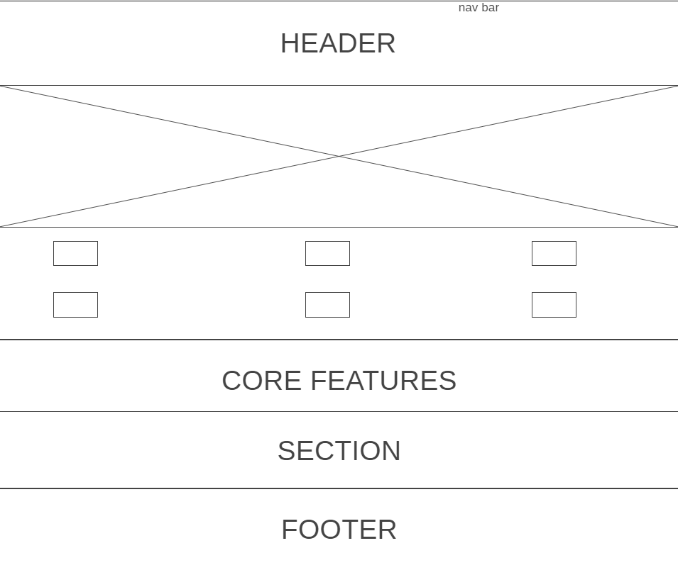

# Development Strategy

> `HFY M2/W2 Homework Project: CODE ALONG`

The project includes [__app-theme__ tutorial from Traversy Media](https://www.youtube.com/watch?v=qlA7dputiNc) + strategy of creating branches using Collaboration on GitHub.
The *goals* are:
* practise CSS and HTML
* learn how to work with flexboxes and more sophisticated HTML
* refresh the knowledge of working step-by-step. Creating branches for every commit.
* collaborating on GitHub, learning how to use pull request feature, creating issues, merging requests.

## Wireframe

<!-- include a wireframe for your project in this repository, and display it here -->
<!-- wireframe.cc is a good site for getting started with wireframes -->

## 0. Set-Up

__A User can see my initial repository and live demo__

### Repo

- Generate from 
- Write initial, basic README
- Turn on GitHub Pages

## 1. Header and Navigation

Header includes an company name or logo.
Navigation bar helps the visitor to understand about the content of the webpage or website.
This User story was creared on branch 1-header-navigation

### Repo
This user story was developed on branch *1-header-navigation*.

### HTML

I have changed the title, added header element.
Added navigation bar which is build from ul function.

### CSS

Added CSS on nav bar and header.

### Last step
* Updated dev strategy.
* Created pull request and raised the issue.
* Checked the issue, merged pull request via GiHub.
* The same scenario is done for every next branch.

## 2. Showcase and icons

This user story consists of showcase (nice backgroung image), core features and 6 icons.
The user story was created on branch 2-showcase-icons

### HTML

- showcase (was developed from preloaded template)
- 6 icon images describing basic core features

### CSS

- Added backfround image as a background.
- adjusted showcase
- applied coror to the icons, resized them

### Last step
* Updated dev strategy.
* Created pull request and raised the issue.
* Checked the issue, merged pull request via GiHub.
* Closed the issue.
* The same scenario is done for every next branch.
## 3. Infosection and Footer

This user story was created on branch 3-infosection-footer.
It includes info section, information about the company and footer.

### HTML

- ifosection is bulid from unordered list which are descibing core features and image
- information about company was also build up from <ul> and enter email placeholder.
- added footer

### CSS

- adjusted backgorund color,background color, font, positioning for each section

### Last step
* Updated dev strategy.
* Created pull request and raised the issue.
* Checked the issue, merged pull request via GiHub.
* Closed the issue.
* The same scenario is done for every next branch.
## 4. 4-about

This user story was created on branch 4-about.
The whole about page has been created on this branch.

### HTML

- added HTML code which consists of header, subheader, main page and information about company(same as in home page), footer
- information about company was also build up from <ul> and enter email placeholder.

### CSS

- added CSS on about setion

### Last step
* Updated dev strategy.
* Created pull request and raised the issue.
* Checked the issue, merged pull request via GiHub.
* Closed the issue.
* The same scenario is done for every next branch.
## 5. 5-services

This user story was created on branch 5-services.
The whole about page has been created on this branch.

### HTML

- added HTML code which consists of header, subheader, main page and information about company(same as in home page), footer
- information about company was also build up from <ul> and enter email placeholder.

### CSS

- added CSS on <ul>

### Last step
* Updated dev strategy.
* Created pull request and raised the issue.
* Checked the issue, merged pull request via GiHub.
* Closed the issue.
* The same scenario is done for every next branch.
## 6. 6-contacts

This user story was created on branch 6-contacts.
The whole about page has been created on this branch. The template was sed from the previous branches, however here the 

### HTML

- added HTML code which consists of header, subheader, main page and information about company(same as in home page), footer
- added form as a section element
- changed subheader name
## 7. 7-media

### CSS

- added media queries to creare a responsive navigation menu, that varies in design on different screen sizes.

### Last step
* Updated dev strategy.
* Created pull request and raised the issue.
* Checked the issue, merged pull request via GiHub.
* Closed the issue.
* The same scenario is done for every next branch.

## Finishing Touches

- Write final, complete README:
  - [makeareadme.com](https://www.makeareadme.com/)
  - [bulldogjob](https://bulldogjob.com/news/449-how-to-write-a-good-readme-for-your-github-project)
  - [meakaakka](https://medium.com/@meakaakka/a-beginners-guide-to-writing-a-kickass-readme-7ac01da88ab3)
- Validate code to check for any last mistakes
